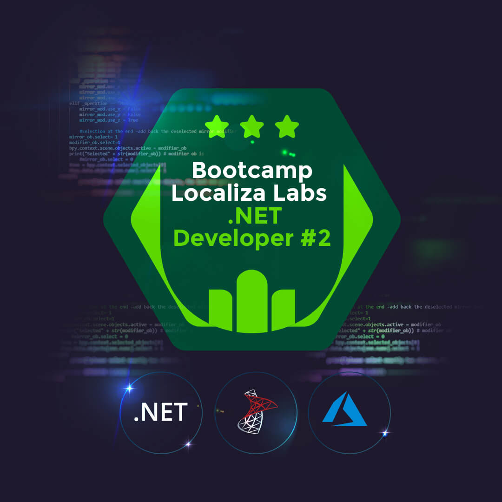

 
  <h1>Repositório do bootcamp LocalizaLabs-.NET-Developer-2 da DIO</h1>
  

Nesse bootcamp estou aprendendo os principais conceitos sobre .NET para atuação em projetos de desenvolvimento web e de componentes de interface de usuários.
 

    
   

 

 <h2>Certificados obtidos nesse bootcamp</h2>

  
   

  **[Meus certificados em pdf](https://github.com/WelbertJr/Bootcamp-DIO---LocalizaLabs-.NET-Developer-2/tree/main/Certificados)**
  

  <h2>Acompanhe meu progresso</h2>
    
  **[Meu perfil na DIO](https://web.dio.me/users/welbertjunior?tab=achievements)** 
  

